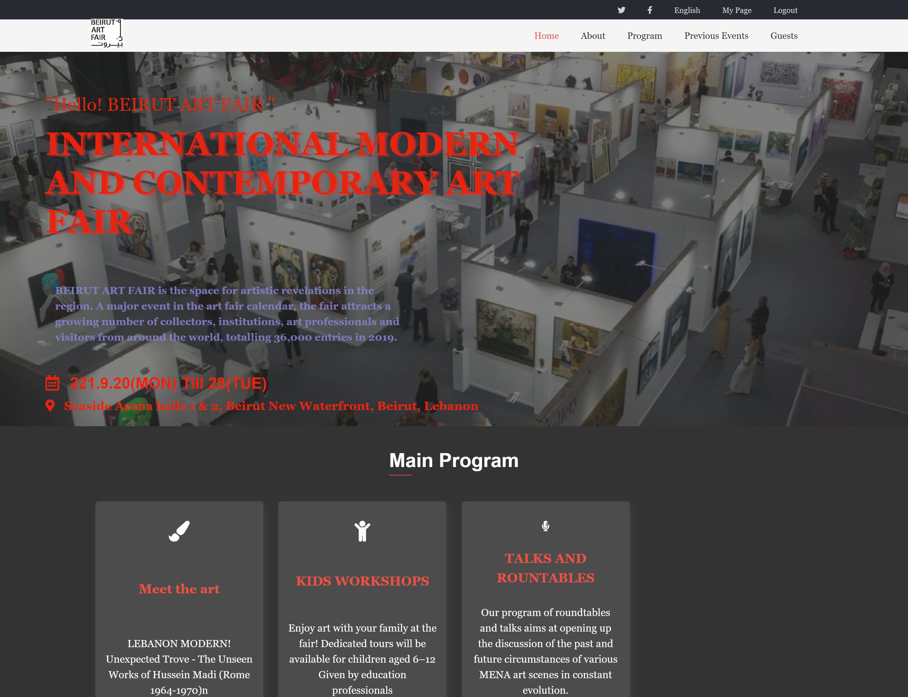

# Capston Project

>This project contains the HTML, CSS and JavaScript Capstone Project. Capstone Projects are done at the end of a module at Microverse.

# Project Name:
## Beirut Art Fair
>BEIRUT ART FAIR is the space for artistic revelations in the region, and it takes place in Beirut every year.

## Built With
HTML
CSS
JavaScript

## Live Demo
you can see this project [live](https://alaaalsalem.github.io/First_capstone/index.html)

### to get a local copy up and running follow these simple example steps.
> open terminal 
> tyoe git clone then copy and past the[link](https://github.com/AlaaAlsalem/First_capstone.git) of repositry 
> cd to First_capstone file 
> then create a new branch 
> then you could open it with any editor you choose, if you would like to use VScode, then type code .

## Authors

👤 **Aladdin Alsalem**

- GitHub: [@githubhandle](https://github.com/AlaaAlsalem)
- LinkedIn: [LinkedIn](https://www.linkedin.com/in/aladdin-alsalem-5a68ba1a0/)

## Show your support

Give a ⭐️ if you like this project!

## Acknowledgments

- this site Original design idea by Cindy Shin in Behance [seeProfile](https://www.behance.net/adagio07)

- Hat tip to anyone whose code was used
- Inspiration
- etc

## 📝 License

This project is [MIT](./MIT.md) licensed.
